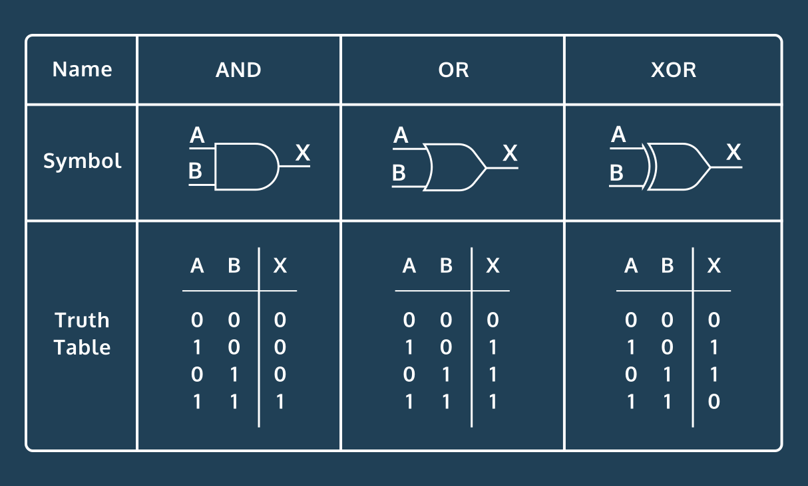

# Logic Gates

In this project, I will delve into the world of perceptrons, aiming to model the fundamental building blocks of computers known as logic gates. Logic gates are elementary components that underlie the operations performed by digital computers. This project serves as a hands-on exploration of how perceptrons can be employed to emulate the behavior of logic gates.

**Key Project Objectives:**

1. **Logic Gates Overview**: I will start by understanding the fundamental concept of logic gates, which are responsible for performing logical operations in computing. Logic gates such as AND, OR, and XOR play a pivotal role in digital circuits by manipulating binary data (0s and 1s). 

2. **Modeling an AND Gate**: I will explore how an AND gate can be represented as a dataset of four points, where each point corresponds to a possible input combination (0 or 1). These points will be associated with labels representing the output of the AND gate for each input combination. The challenge here is to demonstrate that this data is linearly separable, making it suitable for a perceptron to learn and predict.

3. **Building a Perceptron**: I will create a perceptron, a simple type of artificial neural network, to learn the behavior of an AND gate. The perceptron will be trained on the dataset to understand how AND gate logic can be approximated using a linear model.

4. **Model Evaluation**: I will evaluate the perceptron's performance by measuring its accuracy on the training data. Since the dataset is relatively small and contains all possible inputs, it provides an opportunity to assess how well the perceptron can learn and predict the behavior of the AND gate.

5. **Exploring XOR and OR Gates**: After successfully modeling an AND gate, I will experiment with XOR and OR gates, which are known to be more complex due to their non-linearity. I will visualize the perceptron's decision boundaries and evaluate its accuracy in these scenarios to observe how perceptrons handle non-linear separability.

6. **Visualizing Decision Boundaries**: To gain deeper insights into the perceptron's decision-making process, I will visualize the decision boundaries it creates for different logic gates. I will examine how close data points are to these boundaries and depict this information using heatmaps.

By the end of this project, I aim to showcase the versatility of perceptrons in modeling logic gates and illustrate how they can approximate complex logical operations, paving the way for more sophisticated neural networks capable of solving intricate problems.

